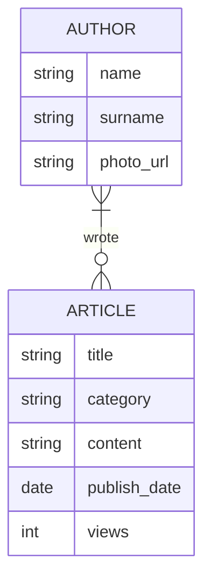
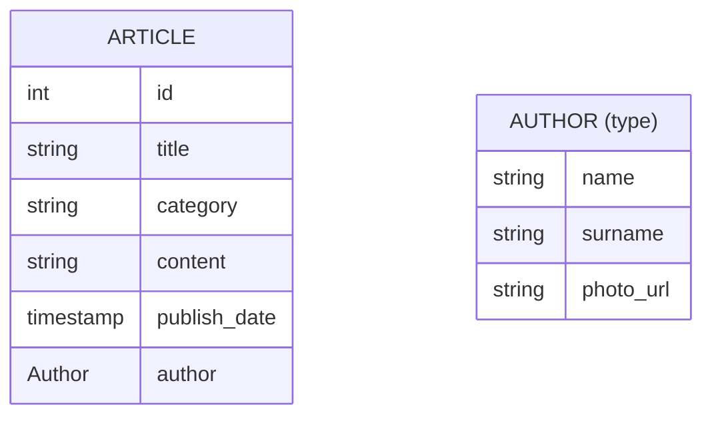
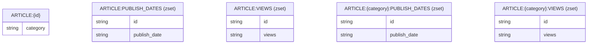

# Užduotis #5: Situacijos analizė

[Užduoties ataskaita](https://www.overleaf.com/1798951545qczvyyyfgjwn#933f28)

## Užduoties formuluotė

- įvertine reikalavimus, parinkite tinkamą duomenų bazę (ar kelias)
- pasirenkant duomenų bazę atlikite alternatyvų analizę, įvertinkite kelių žinomų duomenų bazių (ar jų kombinacijų) tinkamumą
  - įvertinkite užklausų kalbos galimybes
  - plečiamumą
  - saugojimo formatų įtaką
- pasirinkę duomenų bazę, pateikite jos fizinį duomenų modelį: laukus, tipus, raktus (ir jų tipus Cassandra atveju), particijų raktus, indeksus
- pateikite duomenų bazės sukūrimo, bei tipinių užklausų sakinius

## Užduotis

Naujienų portale publikuojamos aktualios naujienos bei kiti žurnalistiniai straipsniai. Straipsniai organizuojami kategorijomis.

- Registruoti sistemoje žurnalistai gali įkelti naujus straipsnius.
- ~~[Arnas] Sistemoje saugomas žurnalisto vardas, pavardė, nuoroda į nuotrauką.~~
- ~~[Arnas] Kiekvienas straipsnis turi: publikavimo datą, autorių, antraštę, tekstą, kategoriją.~~
- ~~[Viktorija] Portalo pagrindinis puslapis rodo 5 skaitomiausius straipnius publikuotus per paskutines 24 valandas.~~
- ~~[Arnas] Portalo pagrindinis puslapis rodo kiekvienos kategorijos 2 naujausius straipsnius.~~
- ~~[Viktorija] Tam, kad galėtų sekti straipsnių populiarumą, portalas seka, kiek kartų straipsnis buvo perskaitytas (atidaryta jo nuoroda).~~
- ~~[Viktorija] Skaitytojai taip pat gali atsidaryti konkrečią kategoriją ir pamatyti jos straipsnius surikiuotus pagal publikavimo datą arba populiarumą.~~
- Papildomai: portale galima ieškoti straipsnių (full text search).

Portalo pagrindinis puslapis, bei kategorijų puslapiai turi atsidaryti itin greitai.

## Implementacija

### Dalykinė ER diagrama

### Alternatyvų analizė

- Alt 1
- Alt 2

### Pagrindinė implementacija

Pagrindinei implementacijai pasirinkta naudoti kombinaciją:

- Elasticsearch - straipsnių saugojimui ir paieškai pagal turinį
- Redis - peržiūrų skaičiavimui, populiariausių straipsnių paieškai

#### Fizinis duomenų modelis

Elasticsearch ER diagrama:

Redis ER diagrama:

