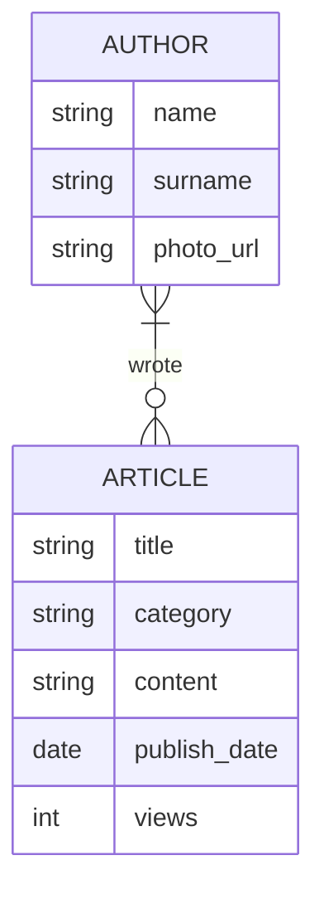
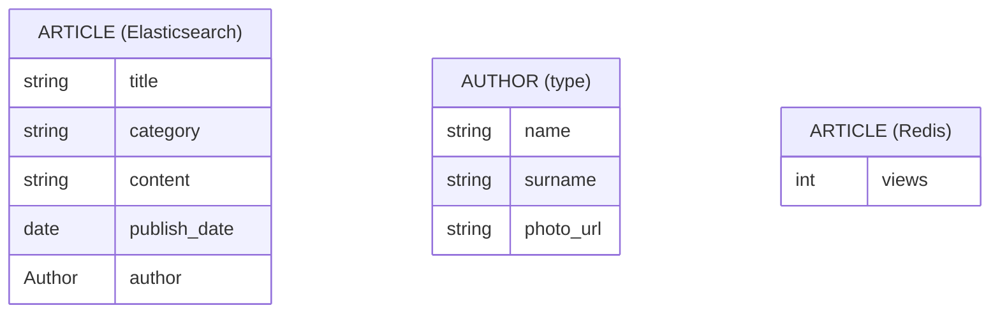

# Situacijos analizė

- įvertine reikalavimus, parinkite tinkamą duomenų bazę (ar kelias)
- pasirenkant duomenų bazę atlikite alternatyvų analizę, įvertinkite kelių žinomų duomenų bazių (ar jų kombinacijų) tinkamumą
  - įvertinkite užklausų kalbos galimybes
  - plečiamumą
  - saugojimo formatų įtaką
- pasirinkę duomenų bazę, pateikite jos fizinį duomenų modelį: laukus, tipus, raktus (ir jų tipus Cassandra atveju), particijų raktus, indeksus
- pateikite duomenų bazės sukūrimo, bei tipinių užklausų sakinius

## Užduotis

Naujienų portale publikuojamos aktualios naujienos bei kiti žurnalistiniai straipsniai. Straipsniai organizuojami kategorijomis.

Registruoti sistemoje žurnalistai gali įkelti naujus straipsnius. Sistemoje saugomas žurnalisto vardas, pavardė, nuorodą į nuotrauką.

Kiekvienas straipsnis turi:

- publikavimo datą
- autorių
- antraštę
- tekstą
- kategoriją

Portalo pagrindinis puslapis rodo 5 skaitomiausius straipnius publikuotus per paskutines 24 valandas, toliau kiekvienos kategorijos 2 naujausius straipsnius. Tam, kad galėtų sekti straipsnių populiarumą, portalas seka kiek kartų straipsnis buvo perskaitytas (atidaryta jo nuoroda).

Skaitytojai taip pat gali atsidaryti konkrečią kategoriją ir pamatyti jos straipsnius surikiuotus pagal publikavimo datą arba populiarumą.

Portalo pagrindinis puslapis, bei kategorijų puslapiai turi atsidaryti itin greitai.

Papildomai: portale galima ieškoti straipsnių (full text search).

## Implementacija

### Dalykinė ER diagrama



### Alternatyvų analizė

- Alt 1
- Alt 2

### Pagrindinė implementacija

Pagrindinei implementacijai pasirinkta naudoti kombinaciją:

- Elasticsearch - straipsnių saugojimui ir paieškai pagal turinį
- Redis - peržiūrų skaičiavimui, populiariausių straipsnių paieškai

#### Fizinis duomenų modelis

TODO:

- Kaip saugom straipsnio išleidimo datą redis'e?
- Ar pridedam papildomą ID, kad lengvai match'inti Redis'o ir Elasticsearch straipsnius?



##### Pagrindinės duomenų paieškos užklausos

```python
```
